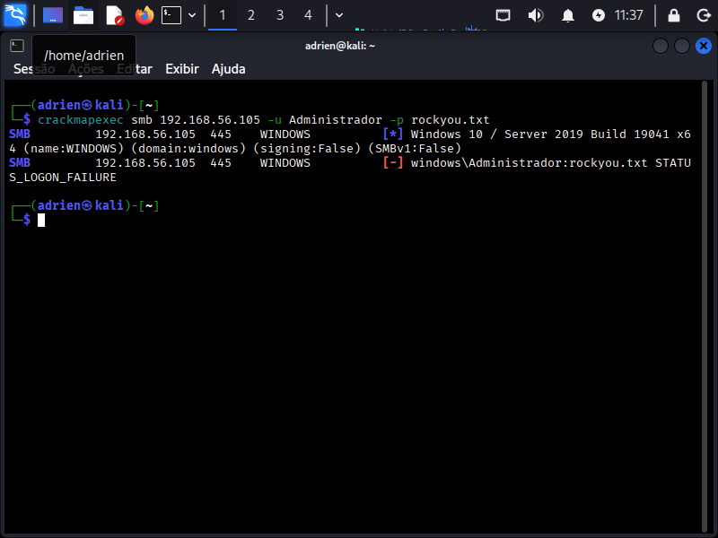
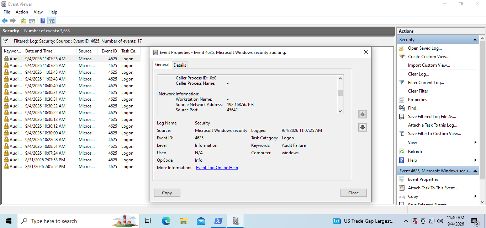
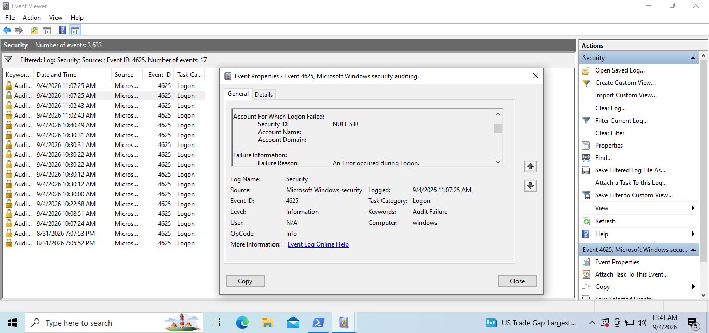
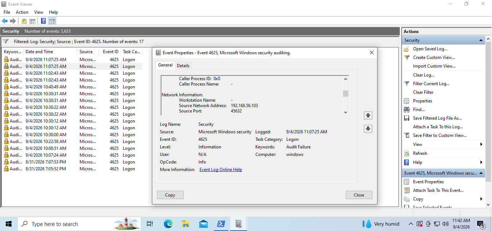

# Força Bruta via SMB — Investigação

## O que foi feito
A partir da VM do Kali Linux, foi executado um ataque de força bruta contra o 
serviço SMB de uma VM Windows 10, utilizando o comando:

crackmapexec smb <ip_do_windows> -u Administrador -p rockyou.txt

## Evidência no Event Viewer
Cada tentativa gerou dois eventos 4625 no log de segurança do Windows: um 
correspondente à tentativa de autenticação em si, e o outro ao handshake/negociação de conexão SMB.

### Evento de autenticação (com credencial testada)

Account Name "Administrador" e Account Domain "windows" 
identificados no evento.

Mesmo evento, mostrando o Source Network Address com o IP 
do Kali Linux e confirmando a origem do ataque.

### Evento de handshake (negociação inicial da conexão)

Mesma tentativa de requisição, porém sem o Account Name e o Account Domain 
preenchidos, apenas NULL SID.

Mesmo evento da fase de negociação, que também mostra o IP de origem do Kali Linux, e 
confirma que ambos os eventos pertencem à mesma tentativa de conexão.

## Por que dois eventos por tentativa?
Comparando os dois eventos gerados na mesma tentativa, em ambos o Security 
ID aparece como NULL SID (padrão em falha de logon). A diferença está nos 
campos Account Name e Account Domain do Event Viewer, preenchidos apenas no evento de 
autenticação (prints 2 e 3), e vazios no evento de handshake (prints 4 e 5).
No entanto, nos dois eventos o IP de origem do Kali Linux fica registrado.

## Conclusão
Investigando os eventos gerados, percebi que os vários eventos de número 4625 não correspondem diretamente aos números de tentativas de ataque. Este detalhe me levou a entender a importância de analisar cada evento individualmente, e saber que deve-se analisar as informações fornecidas antes de tirar uma conclusão.
