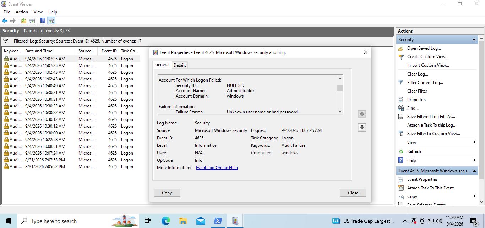

# Força Bruta via SMB — Investigação

## O que foi feito
A partir do Kali Linux, foi executado um ataque de força bruta contra o 
serviço SMB de uma VM Windows 10, utilizando o NetExec:

nxc smb <IP_DO_WINDOWS> -u Administrador -p wordlist_pequena.txt

## Evidência no Event Viewer
Cada tentativa gerou dois eventos 4625 no log de segurança do Windows: um 
correspondente ao handshake/negociação da conexão SMB, e outro à tentativa 
de autenticação em si.

### Evento de autenticação (com credencial testada)

Account Name "Administrador" e Account Domain "windows" 
identificados no evento.

Mesmo evento, mostrando o Source Network Address com o IP 
do Kali Linux, confirmando a origem do ataque.

### Evento de handshake (negociação inicial da conexão)
**Print 4** — Mesmo evento (4625), porém sem Account Name/Domain 
preenchidos — apenas NULL SID.
**Print 5** — Mesmo evento, também mostrando o IP de origem do Kali, 
confirmando que ambos os eventos pertencem à mesma tentativa de conexão.

## Por que dois eventos por tentativa?
Comparando os dois eventos gerados na mesma tentativa: em ambos o Security 
ID aparece como NULL SID (padrão em falha de logon). A diferença está nos 
campos Account Name e Account Domain, preenchidos apenas no evento de 
autenticação (Prints 2 e 3), e vazios no evento de handshake (Prints 4 e 5).
Em ambos os casos, porém, o IP de origem (Kali) fica registrado — evidência 
de que os dois eventos vêm da mesma conexão de rede.

## Conclusão
O volume real de tentativas de senha corresponde à metade do total de 
eventos 4625 registrados. Um analista que correlacionar pelo total bruto 
superestima o ataque em 2x.

**Ação recomendada:** alertar sobre picos de eventos 4625 **com Account 
Name preenchido**, não pelo total bruto — e configurar limite de tentativas 
falhas por conta/IP de origem em uma janela de tempo curta.
